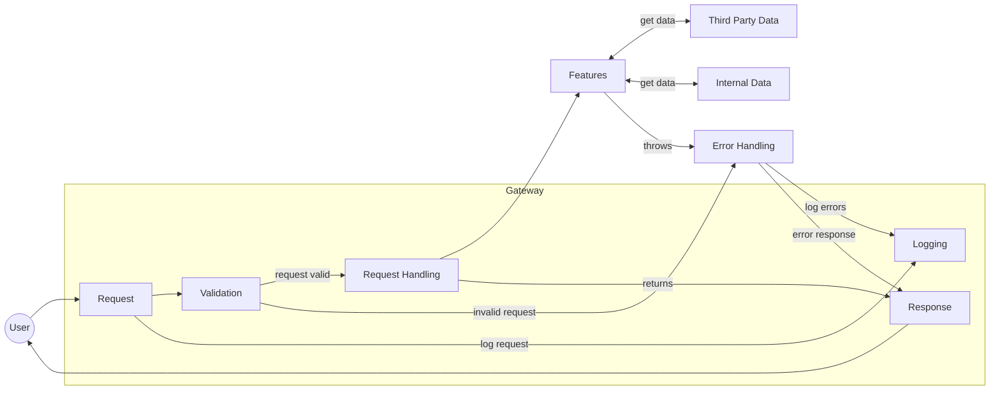
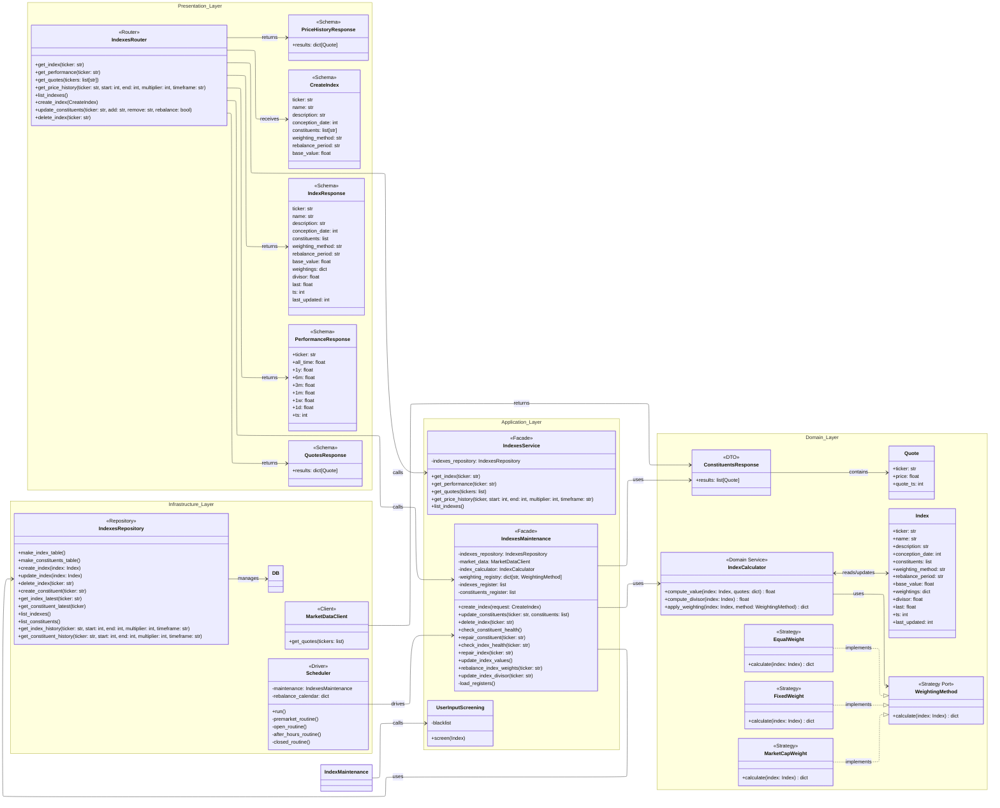
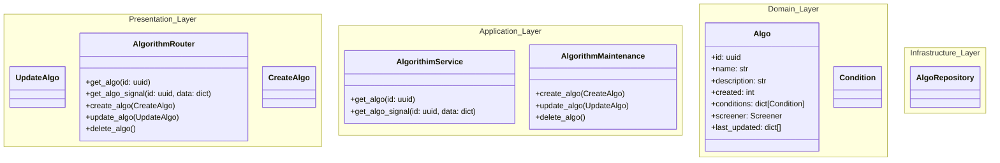

```mermaid
---
config:
  layout: elk
  elk:
    nodePlacementStrategy: LINEAR_SEGMENTS
---
classDiagram
direction RL
namespace Presentation_Layer {
class MarketDataRouter {
        <<Router>>
+get_tickers(tickers: list)
+get_quotes(tickers: list)
+get_historical_prices(tickers: list, dates: list)
+get_bars(ticker: str, multiplier: int, timeframe: str, start: int, end: int)
+get_news(tickers: list)
+get_moving_average(ticker: str, method: str, multiplier: int, timeframe: str, start: int, end: int)
+get_atr(ticker: str, multiplier: int, timeframe: str, start: int, end: int)
}

class TickersResponse {
        <<Schema>>
        +results : dict[Tickers]
}

class QuotesResponse {
        <<Schema>>
        +results : dict[Quotes]
}

class PriceHistoryResponse {
        <<Schema>>
        +ticker : str
        +price : float
        +ts : int
}

class BarsResponse {
        <<Schema>>
        +results : dict[Bars]
}

class NewsResponse {
        <<Schema>>
        +results : dict[News]
}

class IndicatorResponse {
        <<Schema>>
        +results : dict[IndicatorPoint]
}
}

namespace Application_Layer {
    class MarketDataService {
        <<Facade>>
        -ticker_providers : list
        -quote_providers : list
        -historical_providers : list
        -news_providers : list
        -indicator_registry : dict[str, Indicator]
        +get_tickers()
        +get_quotes()
        +get_historical_prices()
        +get_bars()
        +get_news()
        +get_indicator(name: str, ticker: str, params: dict)
    }
}

namespace Domain_Layer {
class Quote {
        price : float
        ts : int
}

class Ticker {
        ticker : str
        name : str
        city : str
        state : str
        market_cap : float
        logo : str
}

class IndicatorPoint {
        value : float
        ts : int
}

class Bar {
        open : float
        high : float
        low : float
        close : float
        volume : float
        ts : int
}

class News {
        ticker : str
        title : str
        summary : str
        link : str
        img : str
}

class Indicator {
        <<Strategy Port>>
+calculate(bars: list) list~IndicatorPoint~
}

class MovingAverage {
        <<Strategy>>
        -method : str
        -multiplier : int
+calculate(bars: list) list~IndicatorPoint~
}

class ATR {
        <<Strategy>>
        -multiplier : int
+calculate(bars: list) list~IndicatorPoint~
}
}

namespace Infrastructure_Layer {
class TickerProvider {
        <<Port>>
+get_tickers()
}

class QuoteProvider {
        <<Port>>
+get_quotes()
}

class HistoricalProvider {
        <<Port>>
+get_historical_prices()
+get_bars()
}

class NewsProvider {
        <<Port>>
+get_news()
}

class MassiveClient {
        <<Adapter>>
        -API_KEY : str
+get_tickers()
+get_quotes()
+get_historical_prices()
+get_bars()
}

class YahooFinanceClient {
        <<Adapter>>
        -API_KEY : str
+get_news()
}
}

MarketDataRouter --> MarketDataService : calls

MarketDataRouter --> TickersResponse : returns
MarketDataRouter --> QuotesResponse : returns
MarketDataRouter --> PriceHistoryResponse : returns
MarketDataRouter --> BarsResponse : returns
MarketDataRouter --> NewsResponse : returns
MarketDataRouter --> IndicatorResponse : returns

MarketDataService --> TickerProvider : depends on
MarketDataService --> QuoteProvider : depends on
MarketDataService --> HistoricalProvider : depends on
MarketDataService --> NewsProvider : depends on
MarketDataService --> Indicator : registry of

MassiveClient ..|> TickerProvider : implements
MassiveClient ..|> QuoteProvider : implements
MassiveClient ..|> HistoricalProvider : implements
YahooFinanceClient ..|> NewsProvider : implements

MovingAverage ..|> Indicator : implements
ATR ..|> Indicator : implements

Indicator --> Bar : consumes
Indicator --> IndicatorPoint : produces

Quote --> QuotesResponse : used by
Ticker --> TickersResponse : used by
Bar --> BarsResponse : used by
IndicatorPoint --> IndicatorResponse : used by

TickerProvider --> Ticker : gives data
QuoteProvider --> Quote : gives data
HistoricalProvider --> Bar : gives data
NewsProvider --> News : gives data
```

# Design Document

---

**Author:** Dylan Liesenfelt

**E-mail:** `djliesenfelt@outlook.com`

**Creation Date:** September 15, 2026

**Last Updated:** September 19, 2026

**Version:** v1.0

---

## Outline

Stonks is a portfolio project of mine that has seen different implementations and itterations by me over the past two. As have grown as a software engineer and my knowledege and skills have evolved, different itterations of Stonks have existed. This will be the final and definitive itteration of Stonks to show a professional level piece of open-source/free-ware stock market data platform. Its main purpose is to exist on my portfolio site and help me test and research things related to finanical markets.

---

## System Overview

This project follows a layered architecture. This is a backend only piece of software. But a frontend exists for it at my personal website `www.bubbanaut.net`.

The design is meant to be modular and easily maintainable, so it follows OOP, and SOLID principles moderately (not hyper strict).
The layered appraoch is straight forward; The Gateway is used to process and authenticate requests, that deligates down to each module.

I was tempted to have each module as its own micro-service (and a previous itteration did do this), however this goes back to over-engineering for the sake over-engineering. the scale of the modules is small, not massive systems of their own, so making microservices out of them is; 1. silly and unnecessary, 2. inefficent due to hops from http requests instead of intra program calls.

## System Architecture

---

### Request/Response Handling



### Features

---

#### Market Data

`Market Data` is the core component, our hub of data. Almost all othe modules use it in some way or another. By default the main data provider is massive.com, but can be expanded to any other market data provider as long as the contracts are matched.

##### Design



##### Endpoints

| Method | Path | Router call | Params | Returns |
|---|---|---|---|---|
| GET | `/v1/market-data/tickers` | `get_tickers()` | query: `tickers` (repeatable) | `TickersResponse` |
| GET | `/v1/market-data/quotes` | `get_quotes()` | query: `tickers` (repeatable) | `QuotesResponse` |
| GET | `/v1/market-data/historical-prices` | `get_historical_prices()` | query: `tickers` (repeatable), `dates` (repeatable) | `PriceHistoryResponse` |
| GET | `/v1/market-data/bars` | `get_bars()` | query: `ticker`, `multiplier`, `timeframe`, `start`, `end` | `BarsResponse` |
| GET | `/v1/market-data/news` | `get_news()` | query: `tickers` (repeatable) | `NewsResponse` |
| GET | `/v1/market-data/indicators/moving-average` | `get_moving_average()` | query: `ticker`, `method`, `multiplier`, `timeframe`, `start`, `end` | `IndicatorResponse` |
| GET | `/v1/market-data/indicators/atr` | `get_atr()` | query: `ticker`, `multiplier`, `timeframe`, `start`, `end` | `IndicatorResponse` |


#### Indexes

The Indexes in module provides the means to make, measure, and monitor user created stock indexes.

##### Design

---



##### Endpoints

| Method | Path | Router call | Body / Params | Returns |
|---|---|---|---|---|
| GET | `/v1/indexes/` | `list_indexes()` | none | list of index tickers |
| POST | `/v1/indexes/` | `create_index()` | body: `CreateIndex` | `IndexResponse` |
| GET | `/v1/indexes/quotes` | `get_quotes()` | query: `tickers` (repeatable) | `QuotesResponse` |
| GET | `/v1/indexes/{ticker}` | `get_index()` | path: `ticker` | `IndexResponse` |
| DELETE | `/v1/indexes/{ticker}` | `delete_index()` | path: `ticker` | 204 No Content |
| PATCH | `/v1/indexes/{ticker}/constituents` | `update_constituents()` | query/body: `add`, `remove`, `rebalance` | `IndexResponse` |
| GET | `/v1/indexes/{ticker}/performance` | `get_performance()` | path: `ticker` | `PerformanceResponse` |
| GET | `/v1/indexes/{ticker}/history` | `get_price_history()` | query: `start`, `end`, `multiplier`, `timeframe` | `PriceHistoryResponse` |

#### Trading Algorithims

Trading Algos return "signals"; BUY, HOLD, SELL. Based on the conditions set in the algo by its maker, the signal is returned on demand, not periodically its up the user to determine when to call for the signal (`Paper Trading`).

##### Design 



##### Endpoints

#### Paper Trading

##### Design

```mermaid
---
config:
  layout: elk
  elk:
    nodePlacementStrategy: LINEAR_SEGMENTS
---
classDiagram 
direction
namespace Presentation_Layer {

}
namespace Application_Layer {
    
}
namespace Domain_Layer {

}
namespace Infrastructure_Layer {
    
}
```


##### Endpoints